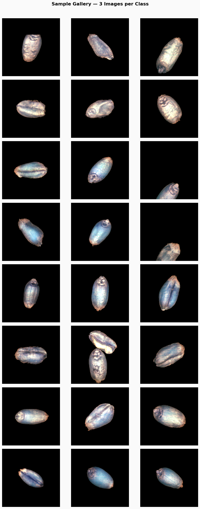

# Grain Variety Classification Challenge


<p align="center">
  
  &nbsp;&nbsp;&nbsp;
  
  &nbsp;&nbsp;&nbsp;
  
</p>

<p align="center">
  <em>Organized by <strong>Université Paris-Saclay</strong>, <strong>LISN</strong> &amp; <strong>INRAE</strong></em>
</p>

<p align="center">
  <a href="https://www.codabench.org/">
    
  </a>
  <a href="https://colab.research.google.com/github/moujar/Grain-Challenge-M1-AI/blob/main/starter_kit/README.ipynb">
    
  </a>
  
  
</p>

---

## Overview

In real agricultural settings, different grain varieties are often **sown together** in the same field. After harvest, the final proportions of each variety can shift due to differences in growth rates, disease resistance, or local adaptation. Accurately identifying which grain belongs to which variety is essential for quality control and agronomic research.

This challenge uses **hyperspectral imaging** cameras that capture rich spectral information far beyond what the human eye can see to distinguish between visually similar grain varieties. Your goal is to build a model that classifies individual grain images into one of **8 possible varieties**.

<p align="center">
  
  <br/>
  <em>Sample grain images across the 8 varieties (3 per class). Each image is captured at spectral bands [22, 53, 89].</em>
</p>

---

## Task Summary

| Property | Details |
|---|---|
| **Input** | 224 × 224 × 3 spectral image (one grain per image) |
| **Output** | Predicted variety label (1–8) |
| **Problem type** | Multi-class image classification |
| **Classes** | 8 grain varieties |
| **Training samples** | 10,000+ (filtered by crop year) |
| **Metric** | Balanced Accuracy |
| **Time limit** | ≤ 20 minutes on Codabench GPU |

---

## Repository Structure

```
Grain-Challenge/
├── starter_kit/
│   ├── README.md               # Starter kit documentation
│   ├── README.ipynb            # Jupyter notebook (open in Colab)
│   ├── input_data/             # Dataset placeholder
│   └── submission/
│       └── model.py            # Baseline model implementation
├── Codabench Bundle/
│   ├── competition.yaml        # Codabench competition config
│   ├── pages/                  # Challenge page content
│   │   ├── overview.md
│   │   ├── data.md
│   │   ├── evaluation.md
│   │   ├── submission.md
│   │   └── terms.md
│   ├── ingestion_program/      # Ingestion pipeline
│   ├── scoring_program/        # Scoring pipeline
│   ├── sample_code_submission/ # ConvNeXt-Tiny baseline (strong)
│   │   ├── model.py
│   │   └── requirements.txt
│   ├── input_data/
│   ├── reference_data/
│   └── utilities/
│       └── compile_bundle.py
├── assets/                     # Images and logos
├── requirements.txt
└── README.md
```

---

## Dataset

The dataset is provided by **INRAE** from real post-harvest hyperspectral scans.

- **Raw source:** 2048 × 9100 px hyperspectral images with 216 spectral channels
- **Preprocessing:** Individual grains extracted via watershed segmentation, then reduced to 3 spectral bands (RGB-like)
- **Final format:** 224 × 224 × 3 images, one per grain, with a class label (1–8)
- **Split:** Training and validation are both performed on the **same year of data**

> The raw hyperspectral images are not provided. All images are already segmented and preprocessed.

Download the dataset from the **Files** tab on the Codabench competition page (inside `starter_kit.zip`).

---

## Getting Started

### 1. Open the Starter Notebook in Colab (recommended)

[](https://colab.research.google.com/github/moujar/Grain-Challenge-M1-AI/blob/main/starter_kit/README.ipynb)

Zero setup required the notebook loads the dataset and runs the baseline end-to-end.

### 2. Clone & install locally

```bash
git clone https://github.com/moujar/Grain-Challenge-M1-AI.git
cd Grain-Challenge-M1-AI
pip install -r requirements.txt
```

### 3. Explore the starter kit

```bash
cd starter_kit
jupyter notebook README.ipynb
```

---

## Baselines

### ConvNeXt-Tiny (`Codabench Bundle/sample_code_submission/model.py`)

A deep learning baseline using a pretrained ConvNeXt-Tiny:
- Pretrained weights: `ConvNeXt-Tiny.pth` (**not included in this repo** due to GitHub's 100 MB file size limit, download it from the starter kit on the CodaBench competition page)
- Trained and validated on the same year of data
- Inference only (no retraining on Codabench)
- Multi-crop × D4 test-time augmentation (4 crop sizes × 8 D4 transforms = 32 views per sample)
- Runs on CPU

---

## Submission

Your submission must be a `model.py` file containing a `Model` class with three methods:

```python
class Model:
    def __init__(self):   # Load weights / initialize
        ...
    def fit(self, train_data):   # train_data = {'X': array, 'y': array}
        ...
    def predict(self, test_data) -> np.ndarray:   # test_data = {'X': array}
        ...
```

### Packaging

```bash
zip submission.zip model.py your_weights.pth notebook.ipynb
```

Upload `submission.zip` via the **My Submissions** tab on Codabench.

> **Important:** Only inference runs on Codabench. If you use pretrained weights (e.g., a `.pth` file), bundle them inside the ZIP alongside `model.py`.

---

## Evaluation

Submissions are evaluated on **Balanced Accuracy**:

```
Balanced Accuracy = (Recall_1 + Recall_2 + ... + Recall_8) / 8
```

- Ground-truth test labels are never shared
- The leaderboard ranks by balanced accuracy (higher is better)
- The test set includes grains from different crop years to assess generalization

---

**Institutions:** [Université Paris-Saclay](https://www.universite-paris-saclay.fr/) · [LISN](https://www.lisn.upsaclay.fr/) · [INRAE](https://www.inrae.fr/)

---

## Contact

For questions about the challenge, dataset, or rules:
- Open an issue on [GitHub](https://github.com/moujar/Grain-Challenge-M1-AI/issues)
- Or contact the organizers via the Codabench platform
